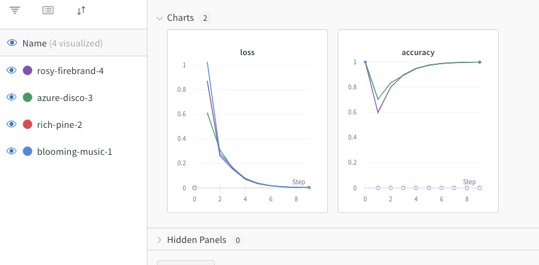

# NeuronRemoteLogger

Package that connects the [Neuron](https://github.com/wvabrinskas/Neuron) package to various remote loggers.


## Supported Loggers
| Loggers       | OS Support | External reqs |
| ------------- | ---------- | ------------- |
| [Weights and Biases](https://wandb.ai/home) | macOS | `python 3`, `wandb` package |

## Protocol 
You can implement your own Remote logger by conforming to the below protocol.

```
public enum Remote {
  case wandb
}

public protocol RemoteLogger {
  associatedtype LogPayload
  associatedtype InitPayload
  
  var type: Remote { get }
  
  init?(payload: InitPayload)
  func setup() throws
  func log(payload: LogPayload) throws
}
```

## Usage

Initialize the logger of your choice. Below is the `Wandb` example

*Note: Wandb requires you call `wandb login` in the CLI before running. The initializer will throw an error here if that has not been done*
```

let epochs = 10
let lr = 0.01

let payload = Wandb.InitializePayload(projectName: "NeuronTest",
                                      config: ["learning_rate": lr.pythonObject,
                                                "epochs": epochs.pythonObject])
guard let wandb = Wandb(payload: payload) else {
  fatalError()
  return
}
      
```

Call `setup` on your logger

```
do {
  try wandb.setup()
} catch {
  fatalError(error.localizedDescription)
  return
}
```

Start logging your data

```
let offset = Double.random(in: 0...1) / 5

for epoch in 0..<epochs {
  let e = Double(epoch)
  let acc = 1 - pow(2, -e - Double.random(in: 0...1) / e - offset)
  let loss = pow(2, -e + Double.random(in: 0...1) / e + offset)
  let payload = ["accuracy": acc.pythonObject, "loss": loss.pythonObject]
  do {
    try wandb.log(payload: payload)
  } catch {
    XCTFail(error.localizedDescription)
  }
}

```
For `Wandb` login to your dashboard to see the results

 
