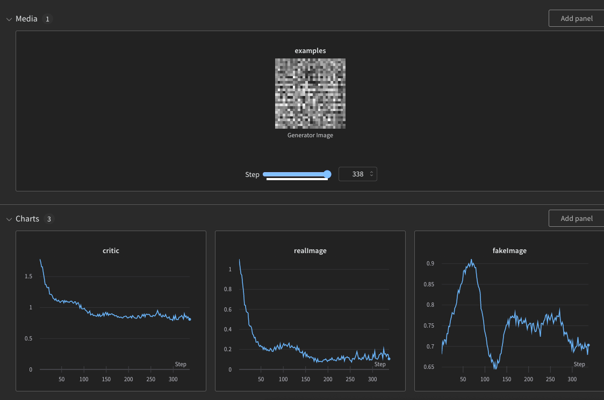

# NeuronRemoteLogger


Package that connects the [Neuron](https://github.com/wvabrinskas/Neuron) package to various remote loggers.


## Supported Loggers
| Loggers       | OS Support | External reqs |
| ------------- | ---------- | ------------- |
| [Weights and Biases](https://wandb.ai/home) | macOS | `python 3`, `wandb` package, `numpy` package, `pillow` package |

## Protocol 
You can implement your own Remote logger by conforming to the below protocol.

```
public enum Remote {
  case wandb
}

public protocol RemoteLogger {
  associatedtype LogPayload
  associatedtype InitPayload
  
  var type: Remote { get }
  
  init?(payload: InitPayload)
  func setup() throws
  func log(payload: LogPayload) throws
  func stop()
}
```

## Usage

Initialize the logger of your choice. Below is the `Wandb` example

*Note: On first run, if you havnt signed into your Wandb account using `wandb login` in the CLI, the LLDB will ask you for your login API key through the debugger. Follow the instructions*
```

let epochs = 10
let lr = 0.01

let payload = Wandb.InitializePayload(projectName: "NeuronTest",
                                      config: ["learning_rate": lr.pythonObject,
                                                "epochs": epochs.pythonObject])
guard let wandb = Wandb(payload: payload) else {
  fatalError()
  return
}
      
```

Call `setup` on your logger

```
do {
  try wandb.setup()
} catch {
  fatalError(error.localizedDescription)
  return
}
```

Start logging your data

```
let offset = Double.random(in: 0...1) / 5

for epoch in 0..<epochs {
  let e = Double(epoch)
  let acc = 1 - pow(2, -e - Double.random(in: 0...1) / e - offset)
  let loss = pow(2, -e + Double.random(in: 0...1) / e + offset)
  
  // this payload can contain any arbitrary tracking data as long as it's convertable to a PythonObject
  // This is specific to wandb. Other loggers will define their own payload.
  let payload = ["accuracy": acc.pythonObject, "loss": loss.pythonObject]
  
  do {
    try wandb.log(payload: payload)
  } catch {
    XCTFail(error.localizedDescription)
  }
}

```

Some of the loggers might support image data upload. For example `Wandb` has a function for building a compatable image object from a 3D array from a `Tensor` 

`func buildImage(data: [[[Float]]], name: String) -> PythonObject?`

You can then log this in the payload by just adding it as a key:
 
`payload["examples"] = buildImage(data: imageData, name: "Generator Image")`

For `Wandb` login to your dashboard to see the results

 
